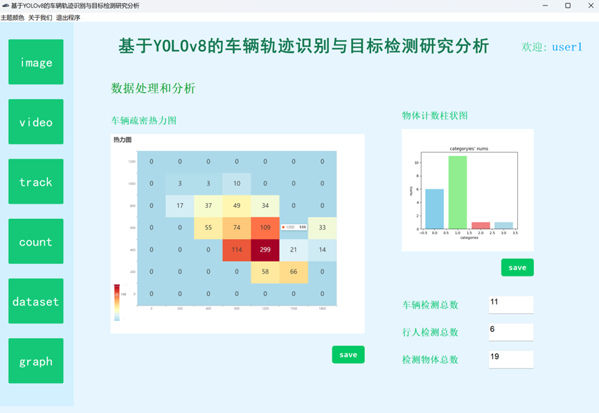
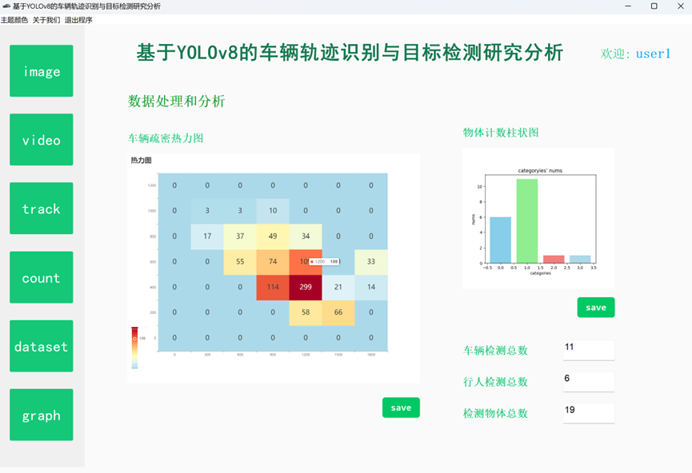
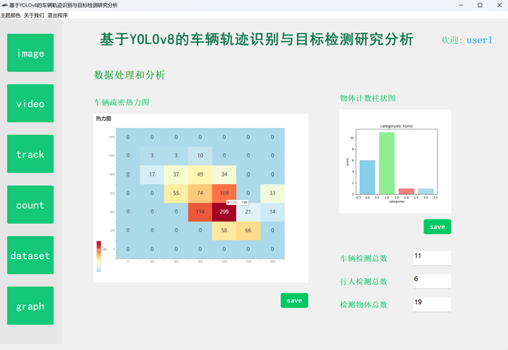
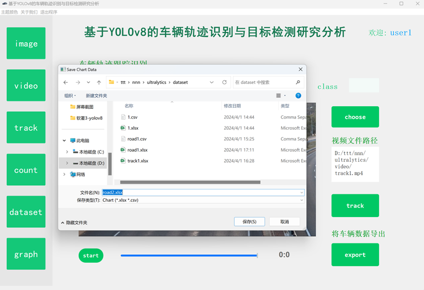
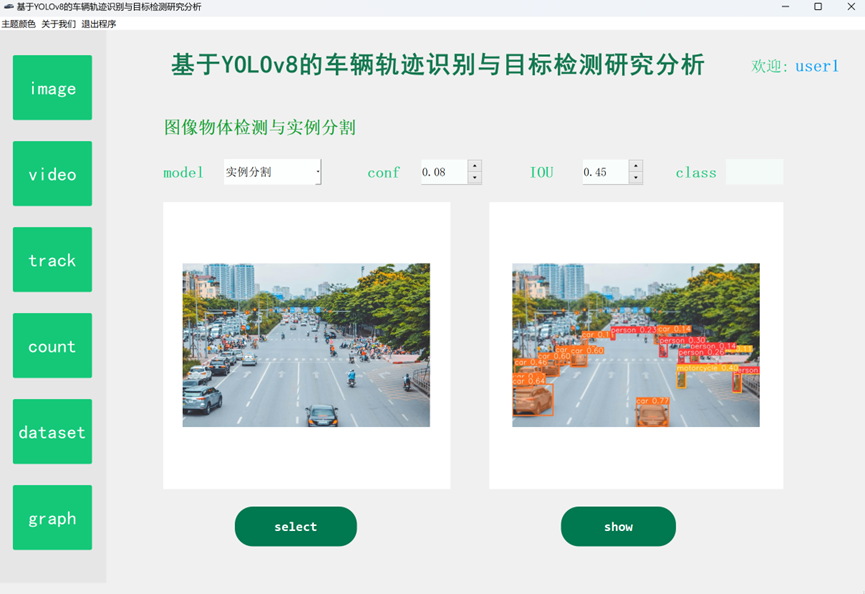
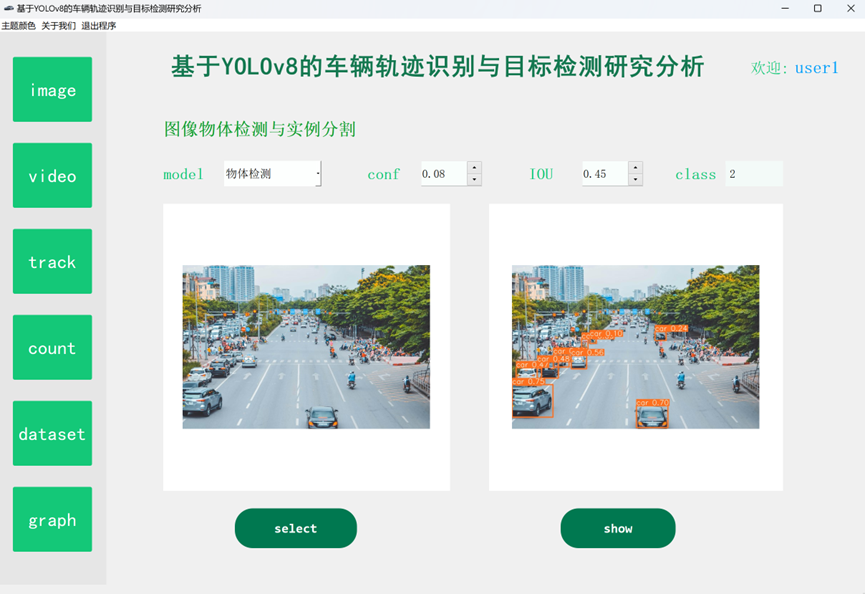
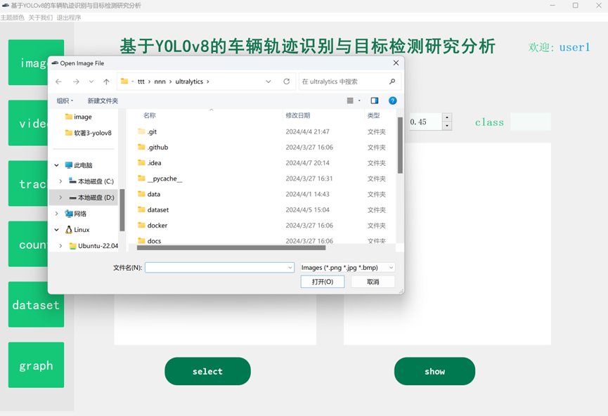
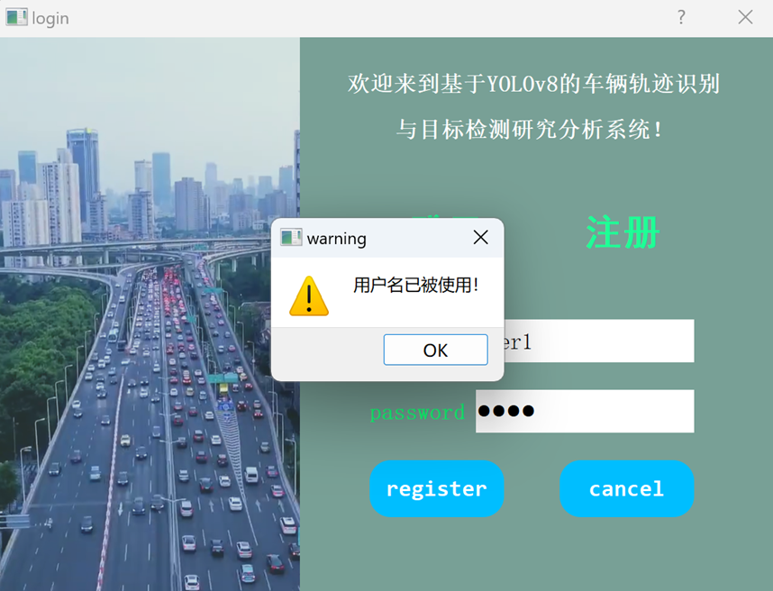

## 计算机毕业设计吊炸天YOLOv8+DeepSeek-R1大模型车辆轨迹识别与目标检测分析系统 交通物体检测与实例分割 交通轨迹识别 交通数据分析 智慧交通

## 要求
### 源码有偿！一套(论文 PPT 源码+sql脚本+教程)

### 
### 加好友前帮忙start一下，并备注github有偿大模型车辆检测
### 我的QQ号是2827724252或者798059319或者 1679232425或者微信:bysj2023nb

# 

### 加qq好友说明（被部分 网友整得心力交瘁）：
    1.加好友务必按照格式备注
    2.避免浪费各自的时间！
    3.当“客服”不容易，repo 主是体面人，不爆粗，性格好，文明人。
## 介绍
### 项目功能 
交通物体检测与实例分割
本项目基于YOLOv8框架，能够对交通物体进行检测。对图片能检测到物体并用锚框进行标注展示，对于视频则是对每一帧进行物体检测分析，同样使用锚框进行标注，最终生成的物体检测视频能实时追踪物体并用不同颜色框进行标注展示。

用户除了选择常规的模型进行物体检测之外，还可以使用专门进行实例分割的模型。在训练预测之后，可以得到不同的物体。与单纯的物体检测有些不同，实例分割能够对物体的轮廓进行较为精细的标注，并将整个物体以特定的颜色进行标注，相比于普通的物体检测能够产生更精细且更好的可视化效果。

### 交通轨迹识别
本项目能够对导入的交通视频进行物体检测，通过物体的id标注，视频的逐帧分析，捕捉每个物体对应的实时位置，同时绘制位置点到视频中，最后整合能够生成带有绘制物体轨迹的视频，实现交通车辆的轨迹识别。

### 车辆越线计数
在进行车辆跟踪，轨迹绘制的基础上，本软件还能对车辆进行越线计数。在视频的关键处，可以绘制分界线，当车辆越过该线时，通过逐帧捕捉车辆坐标信息，对应id后能够进行车辆计数值的自增，实现越线计数的功能。

### 生成交通数据集
在物体轨迹识别的过程，捕捉位置坐标并绘制轨迹时，将不同车辆的位置信息分别记录起来，同时记录车辆id、类别等信息。在视频检测完毕后，对数据进行汇总并做相关处理，能够生成较为理想的交通数据集。

### 交通数据分析
将生成的交通数据集进行导入，能够进行关键数据的具体分析，包括不同类别物体的检测计数，车辆位置信息等。通过热力图，柱状图等方式直观呈现数据，利于清楚看出数据的各项分布情况。

## 演示视频
https://www.bilibili.com/video/BV1h5XSYwEjP/?spm_id_from=333.1387.homepage.video_card.click
## 运行截图

